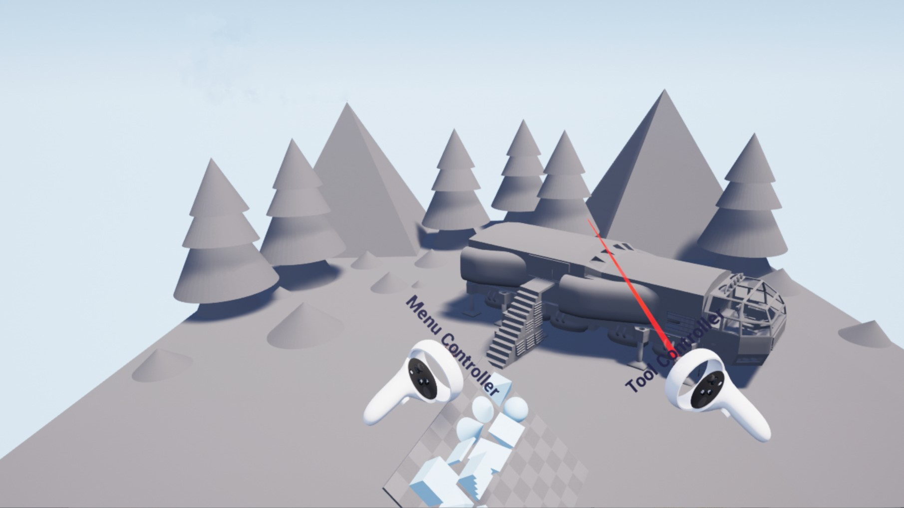
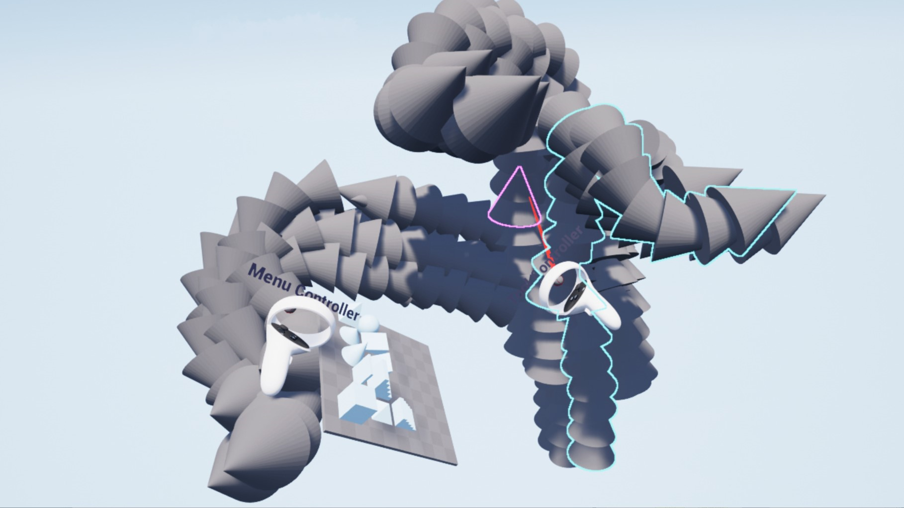
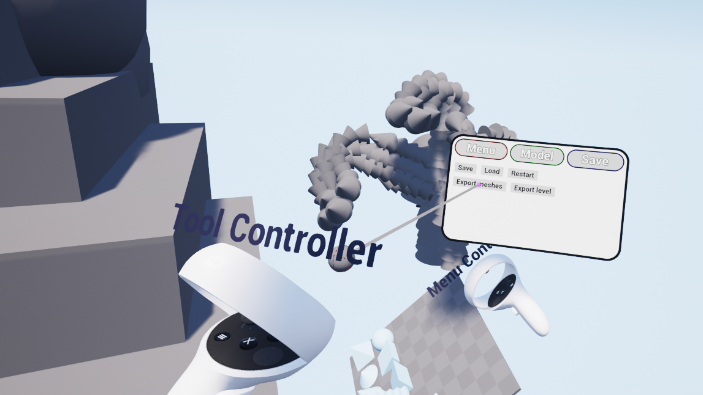
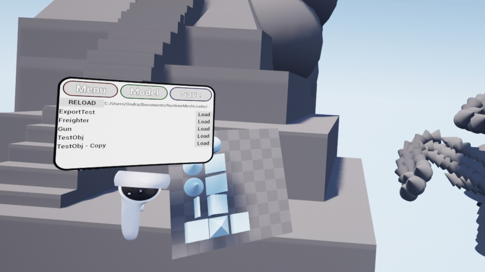
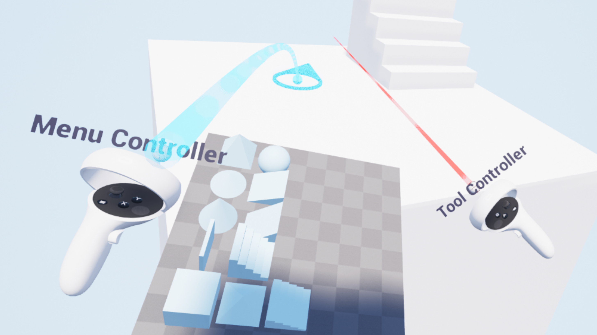
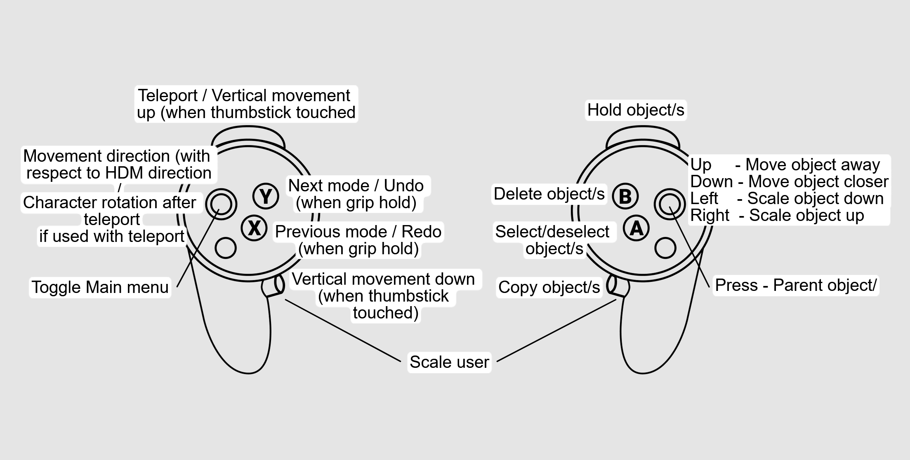

# BlockoutVR

BlockoutVR is a prototype application designed to simplify the process of creating level blockouts in virtual reality (VR).

## Features

- Intuitive and immersive VR environment for blockout creation
- Object manipulation and arrangement capabilities
- Import models, export whole level, save level, etc.
- Developed for Oculus/Meta hardware

## Usage

To use BlockoutVR, follow these steps:

1. Download the [packaged project for Windows](https://drive.google.com/file/d/14HKtplO8EiAintAUOyyRY83ZHdz1VcCr/view?usp=sharing) and unpack the zip file.
2. Run the BlockoutVR.exe.
3. Application starts in VR mode, if your headset is set up properly. (otherwise starts in debug mouse/keyboard mode).

To download source code (Unreal Engine project):
1. Download the [full Unreal Engine project](https://drive.google.com/file/d/1-70PPZSPP9rzTPrRSfDJQfdEF4LDw3B1/view?usp=sharing) and unpack the zip file.

## Screenshots
  
  
  
  
  

## Video showcase (link leads to YT)

## Control Scheme

## License

This project is licensed under the [MIT License](link-to-license-file).

Please refer to the provided zip files and images for the full project and visual references.

For any further inquiries or support, please contact [ondraperny@gmail.com](mailto:ondraperny@gmail.com).
